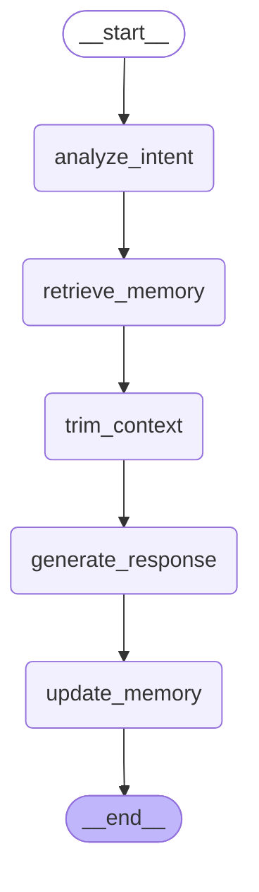

# Agent Graph Visualization

Copy the code below to [Mermaid Live Editor](https://mermaid.live/) to see the diagram.

```mermaid
---
config:
  flowchart:
    curve: linear
---
graph TD;
	__start__([<p>__start__</p>]):::first
	analyze_intent(analyze_intent)
	retrieve_memory(retrieve_memory)
	trim_context(trim_context)
	generate_response(generate_response)
	update_memory(update_memory)
	__end__([<p>__end__</p>]):::last
	__start__ --> analyze_intent;
	analyze_intent --> retrieve_memory;
	generate_response --> update_memory;
	retrieve_memory --> trim_context;
	trim_context --> generate_response;
	update_memory --> __end__;
	classDef default fill:#f2f0ff,line-height:1.2
	classDef first fill-opacity:0
	classDef last fill:#bfb6fc

```